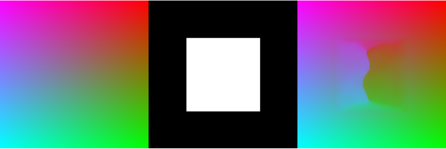
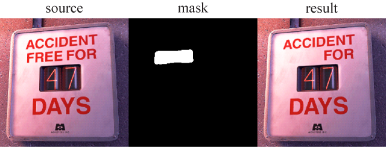

[](https://github.com/61315/resynthesizer/actions/workflows/test.yml)

# resynthesizer

WIP

## Building resynthesizer

### macOS

To compile resynthesizer you must have Xcode installed and you need to make sure the command line tools are setup by running:

```
$ xcode-select --install
```

After that you can build the static library and the examples simply by:

```
$ make
```

Additionally run:
```
$ make fuzz
```

to try the sample images with ranging parameters. 

FYI, the test results should look like this:


## Building examples

### hello



`"Hello, Resynthesizer!"`

Do the synthesis operation against generated bitmaps. Should write `IMAGE_SYNTH_SUCCESS` to the stdout. Serves as a runtime test untill proper unit test scripts are done.

```
$ make examples/hello
$ examples/hello
```

### ppm



Takes in source/mask bitmap and do the image synthesis operation. The dimensions of the source and mask image should match.

```
$ make examples/ppm
$ examples/ppm <source> <mask> <result> <context> <neighbors> <probes>
```

E.g.
```
$ examples/ppm assets/source000.ppm assets/mask000.ppm result000.ppm 1 16 64
```

NOTE: There is a meaningful correlation between **the quality of operation** and the type of fitting method(**context**) described below. The quality of synthesis operation may vary.

| Context | Method      | Shape      | Direction |
|---------|-------------|------------|-----------|
| 0       | Patching    | -          | -         |
| 1       | Shuffle     | Random     | Random    |
| 2       | Brushfire   | Concentric | Inward    |
| 3       | Directional | Horizontal | Inward    |
| 4       | Directional | Vertical   | Inward    |
| 5       | Brushfire   | Concentric | Outward   |
| 6       | Directional | Horizontal | Outward   |
| 7       | Directional | Vertical   | Outward   |
| 8       | Squeeze     | Concentric | Both      |

### painter ([Online Demo](https://61315.github.io/resynthesizer/painter.html))


Interactive painting demo. Performs synthesis operation on-the-fly.

This example requires [SDL2](https://wiki.libsdl.org/Installation) installed on the build machine, otherwise build will not succeed.

`Makefile` tries to locate the SDL2 using `pkg-config` command by default. If facing errors, be sure to check if SDL2 is installed properly or manually provide SDL2 to the linker.

##### Using Homebrew:
- `$ brew install SDL2`

```
$ make examples/painter
$ examples/painter <source>
```

##### Using disk image:
- Download installation package from the [site](https://libsdl.org/download-2.0.php).

```
$ make examples/painter LDFLAG="-F/Library/Frameworks -framework SDL2"
$ examples/painter <source>
```

E.g.
```
$ examples/painter assets/source001.ppm
```
