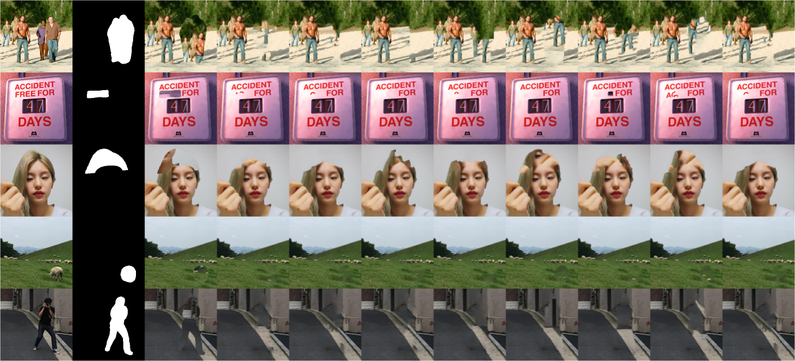

# resynthesizer

WIP

## Building resynthesizer

### macOS

To compile resynthesizer you must have Xcode installed and you need to make sure the command line tools are setup by running:

```
$ xcode-select --install
```

After that you can build the static library and the examples simply by:

```
$ make
```

Additionally run:
```
$ make test
```

to test the sample images. 

FYI, the test results should look like this:
